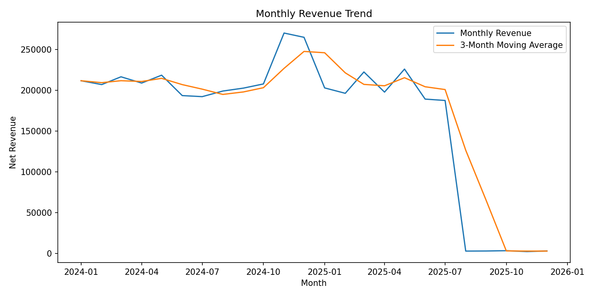
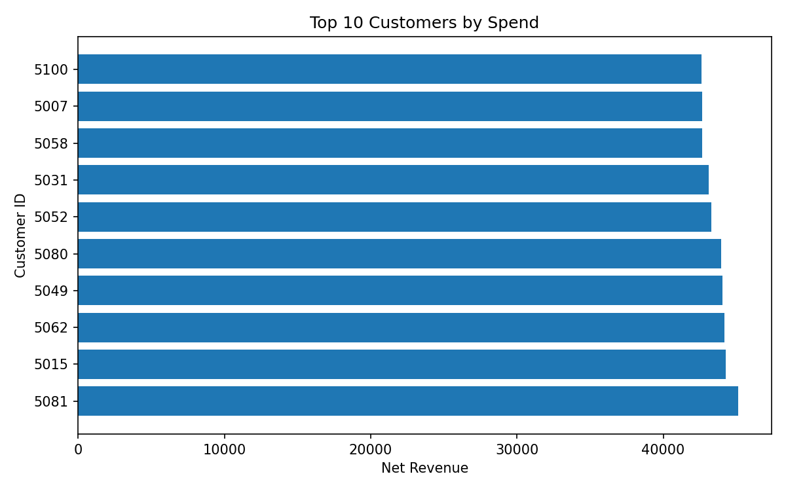
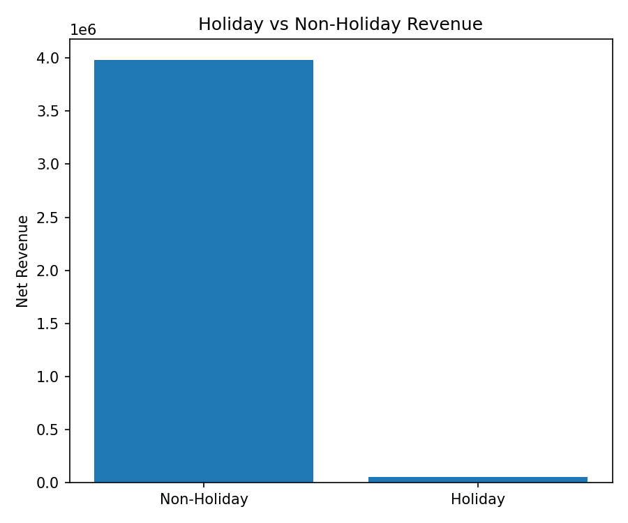
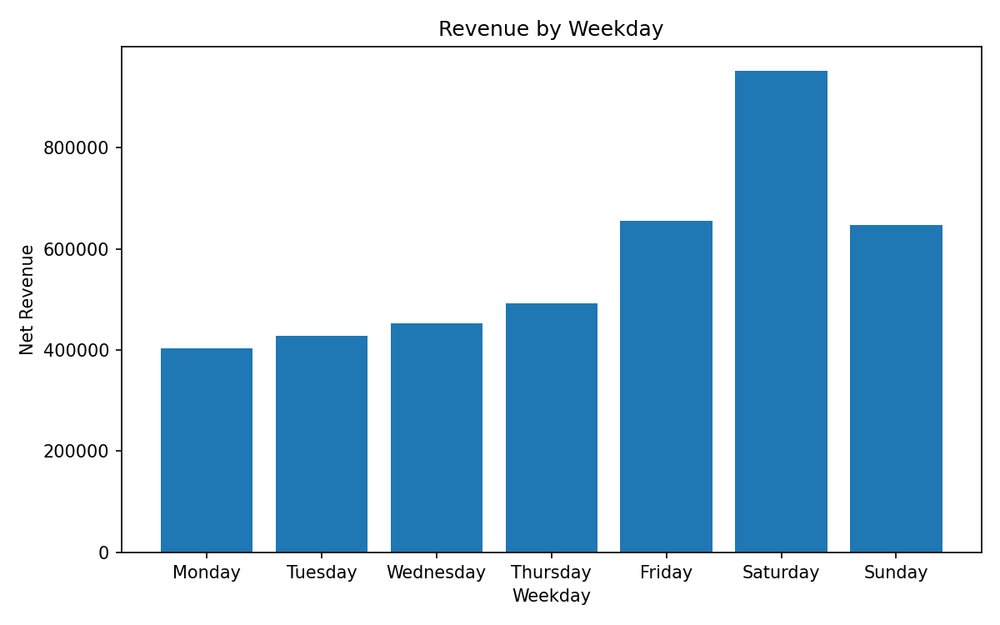
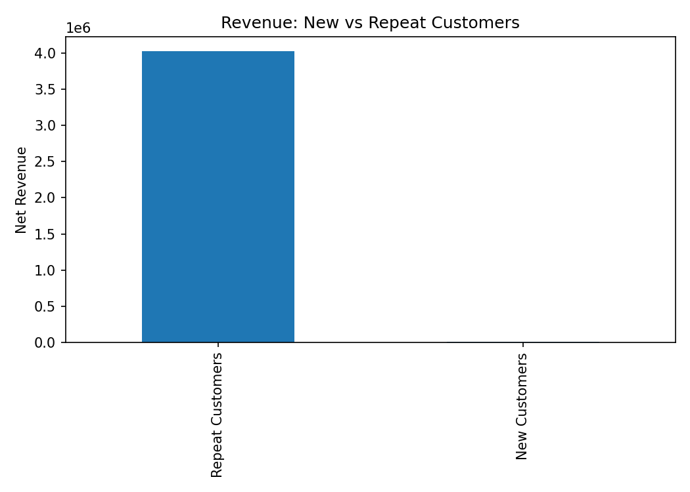
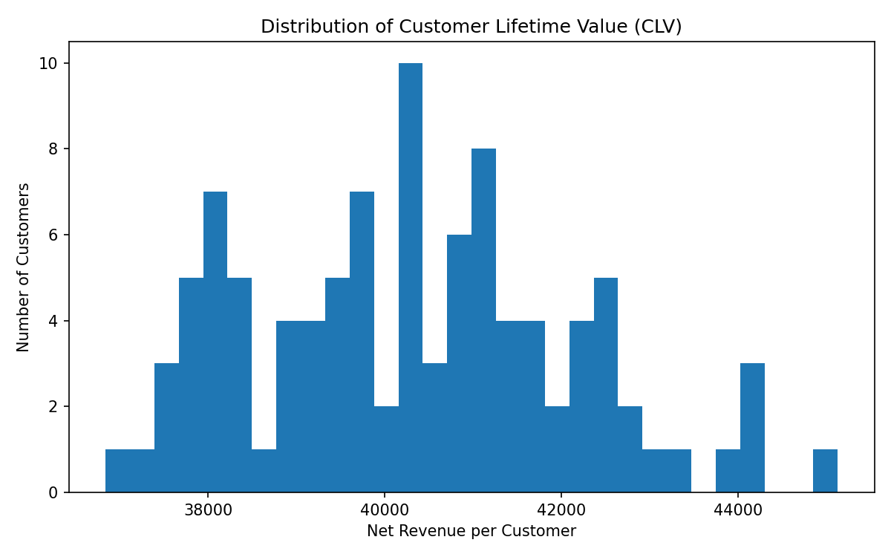

# Retail Project — Sales, Forecasting & E-commerce Planning

---

## 🌟 Project Highlights

This project demonstrates a full retail analytics workflow, showing both **technical skills** and **business impact**:

- Cleaned and structured raw retail datasets into usable formats
- Built **KPI dashboards** (Total Sales, Orders, AOV) for performance tracking
- Created **visualizations** for trends, segmentation, and seasonality
- Designed an **Excel planning pack** for stakeholders
- Applied **forecasting & inventory tracking** to support business decisions

**Why it matters:** This reflects the day-to-day work of e-commerce planning and reporting teams, where turning raw data into clear insights drives better inventory, promotion, and revenue decisions.

---

## 📊 What this project demonstrates
- **Data Cleaning** — handled missing values, standardized formats, saved cleaned datasets
- **KPI Reporting** — Total Sales, Orders, Average Order Value (AOV)
- **Sales Analysis** — by date, product, category, and store
- **Visualization** — sales trends, top products, weekday/holiday patterns
- **Forecasting & Inventory** — simple demand forecasts and out-of-stock tracker
- **Excel Reporting** — automated dashboard exports for planning teams

---

## 🗂 Project Structure
retail_project/
├─ notebooks/ # Jupyter notebooks (data cleaning, reporting, forecasting)
├─ data/ # Datasets (customers, products, sales, stores, holidays)
├─ output/ # Cleaned data + visuals
├─ output_planning/ # Excel dashboard + planning pack
├─ README.md # Project overview
├─ requirements.txt # Dependencies
└─ .gitignore


---

## ⚙️ Tech Stack
- **Python** — pandas, numpy, matplotlib
- **Excel** — reporting & dashboards (via openpyxl)
- **JupyterLab** — interactive analysis

---

## 🚀 Quick Start
Clone the repo and set up dependencies:
```bash
git clone git@github.com:RahmaMohammad/Retail_Project.git
cd Retail_Project
python3 -m venv .venv && source .venv/bin/activate
pip install -r requirements.txt

## 📊 Visual Examples

### Sales Trend Over Time
  
*Insight:* Sales show a clear monthly growth trend with noticeable spikes during holiday seasons, reflecting demand surges and consumer behavior patterns.  

---

### Top 10 Customers
  
*Insight:* A small group of customers contributes disproportionately to revenue, highlighting the importance of client segmentation and retention strategies.  

---

### Holiday vs Non-Holiday Revenue
  
*Insight:* Revenue during holidays is significantly higher than non-holiday periods, showing the impact of promotions and seasonal events on sales performance.  

---

### Weekday Revenue Patterns
  
*Insight:* Mid-week days outperform weekends in revenue generation, a pattern useful for inventory planning and targeted promotions.  

---

### New vs Repeat Customers
  
*Insight:* Repeat customers drive steady revenue, while new customers add spikes, showing the balance between acquisition and retention.  

---

### Customer Lifetime Value Distribution
  
*Insight:* Most customers fall in the low-to-mid CLV range, but a small segment of high-value customers has outsized business impact.  
